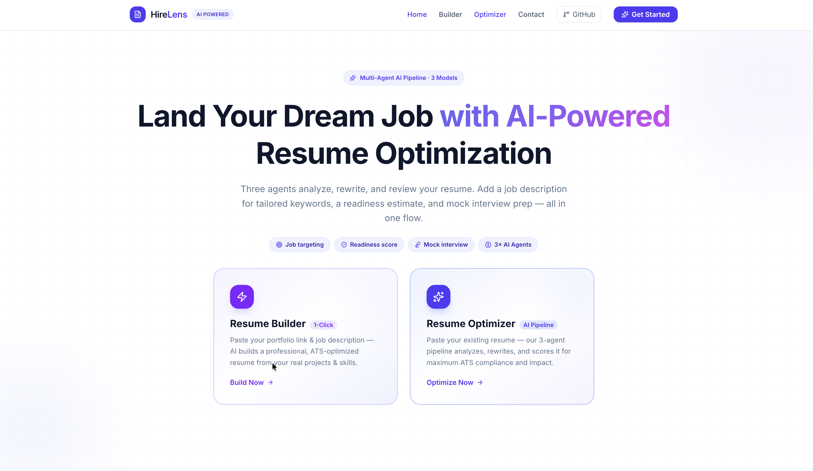
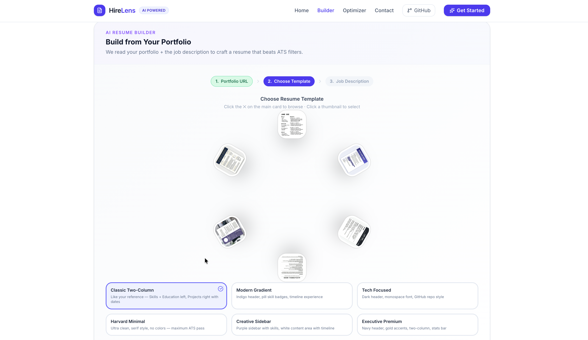

# HireLens — AI Resume Optimization Platform

* [Live Application](https://hirelens.dev)
* [API Documentation](https://documenter.getpostman.com/view/39189648/2sBXiqDo8i)
* [Watch Demo](https://drive.google.com/drive/folders/1tj_dQ3L_6_GkwRvi1QNwPWctzgbShZ4K?usp=sharing)

| Landing Page | UI Customization |
|-------------|----------------|
|  |  |


## 1. Overview

HireLens is an AI-powered SaaS platform designed to analyze resumes and professional profiles to deliver intelligent, actionable optimization insights. The system evaluates resume content, identifies gaps, and provides structured improvements to enhance clarity, relevance, and alignment with industry expectations.

The platform focuses on improving the *quality and effectiveness* of resumes rather than relying solely on keyword matching, enabling users to better present their skills and experience for real-world hiring scenarios.

---

## 2. Problem Statement

Job applicants often lack clarity on why their resumes fail to progress in hiring processes. Existing tools provide generic suggestions and fail to offer meaningful, context-aware feedback.

Key challenges include:

* Lack of actionable insights on resume weaknesses
* Poor alignment with job requirements
* Absence of measurable impact in experience descriptions
* Fragmented professional data across multiple platforms

---

## 3. Proposed Solution

HireLens addresses these challenges through an AI-driven system that:

* Analyzes resumes and external profiles (LinkedIn, GitHub, portfolio)
* Identifies structural, semantic, and content-level issues
* Provides targeted recommendations and improved content rewrites
* Generates structured, professional resumes

The platform transforms resume creation into an insight-driven, iterative process.

---

## 4. Key Features

### 4.1 Resume Analysis

* Extraction of skills, experience, and project details
* Detection of weak phrasing and lack of measurable impact
* Identification of missing or irrelevant information

---

### 4.2 AI Optimization Engine

* Context-aware content improvement
* Keyword alignment with target roles
* Enhancement of bullet points using measurable outcomes

---

### 4.3 Profile Aggregation

* Integration with LinkedIn, GitHub, and portfolio data
* Consolidation of user information into a unified profile
* Automated resume generation from aggregated data

---

### 4.4 Resume Generation

* Structured templates for professional formatting
* AI-assisted content population
* Export-ready resume output

---

### 4.5 Optimization Insights

* Explanation of suggested changes
* Highlighting of key improvement areas
* Guidance aligned with hiring expectations

---

## 5. System Architecture

### 5.1 High-Level Architecture

```
Client (Next.js)
        ↓
API Layer (Serverless Functions)
        ↓
Service Layer (Business Logic)
        ↓
Queue Layer (Asynchronous Processing)
        ↓
AI Processing Layer
        ↓
Database (MongoDB Atlas)
        ↓
File Storage (GridFS / Cloud Storage)
```

---

### 5.2 Architecture Rationale

* **Next.js (Frontend + API Layer):**
  Enables a unified full-stack environment with serverless capabilities for scalability and reduced latency.

* **Service Layer:**
  Separates business logic from request handling, improving maintainability and enabling future transition to microservices.

* **Queue Layer:**
  Handles asynchronous AI processing, ensuring system stability under concurrent requests and preventing bottlenecks.

* **AI Processing Layer:**
  Responsible for resume analysis, content optimization, and insight generation.

* **MongoDB Atlas:**
  Supports flexible schema design required for unstructured resume data and allows horizontal scaling.

* **File Storage:**
  Efficient handling of uploaded resume documents independent of core database operations.

---

## 6. AI Integration

HireLens leverages large language models to:

* Analyze semantic relevance between resume content and job requirements
* Detect weak, generic, or incomplete descriptions
* Generate improved, context-aware suggestions

The system emphasizes **meaningful content improvement** rather than simple keyword matching, enabling more effective resume optimization.
```
┌─────────────────────────────────────────────────────────────────┐
│                    HIRELENS MULTI-AGENT PIPELINE                │
└─────────────────────────────────────────────────────────────────┘

Step 1: Resume Upload
    ↓
Step 2: ANALYZER AGENT
    │
    ├─→ Extract skills, experience, education
    ├─→ Detect weak phrasing ("responsible for", "worked on")
    ├─→ Identify missing quantifiable metrics
    ├─→ Find gaps in keyword alignment
    └─→ Analyze structure and formatting issues
    │
    ↓ Output: Structured Analysis JSON
    │
    ↓
Step 3: OPTIMIZER AGENT
    │
    ├─→ Takes analysis as input
    ├─→ Rewrites weak bullet points with impact
    ├─→ Adds quantifiable metrics where missing
    ├─→ Enhances professional summary
    ├─→ Improves action verbs and phrasing
    └─→ Generates optimized content
    │
    ↓ Output: Improved Resume Content
    │
    ↓
Step 4: REVIEWER AGENT DIFFERENTIATOR
    │
    ├─→ Compares: Original → Improved
    ├─→ Validates: Clarity improvements
    ├─→ Checks: Impact enhancement
    ├─→ Verifies: Keyword relevance
    ├─→ Scores: Quality improvement (0-100%)
    └─→ Generates: Explanation of changes
    │
    ↓ Output: Review & Justification
    │
    ↓
Final Output: Optimized Resume + Why It's Better
```
---

## 7. Scalability and System Design

The platform is designed with scalability and real-world deployment considerations:

* **Stateless API Layer:**
  Supports horizontal scaling across multiple instances

* **Asynchronous Processing:**
  Queue-based system ensures smooth handling of high request volumes

* **Modular Architecture:**
  Enables independent scaling of components such as AI processing and data services

* **Multi-Provider AI Strategy:**
  Ensures reliability and mitigates rate-limiting issues

* **Future Enhancements:**

  * Microservices architecture
  * Caching layer (Redis)
  * Load balancing
  * Multi-region deployment

The current implementation follows a **modular monolith approach** optimized for rapid development, with clear pathways for scaling.

---

## 8. Technology Stack

```
Frontend:
┌──────────────┐  ┌──────────────┐  ┌──────────────┐
│   Next.js    │  │  TypeScript  │  │ Watermelon   │
│   (App       │  │              │  │     UI       │
│   Router)    │  │              │  │              │
└──────────────┘  └──────────────┘  └──────────────┘

Backend & Infrastructure:
┌──────────────┐  ┌──────────────┐  ┌──────────────┐
│   Vercel     │  │   MongoDB    │  │   Redis/     │
│              │  │   Atlas      │  │   Upstash    │
└──────────────┘  └──────────────┘  └──────────────┘

AI & APIs:
┌──────────────┐  ┌──────────────┐  ┌──────────────┐
│   Gemini     │  │  Hugging     │  │   Groq       │
│   (Primary)  │  │   Face       │  │   (Fast)     │
└──────────────┘  └──────────────┘  └──────────────┘
```

* **Frontend:** Next.js
* **Backend:** Node.js (API Routes)
* **Database:** MongoDB Atlas
* **AI Integration:** External LLM APIs (Gemini / Hugging Face / Groq / Cohere)
* **Queue System:** Redis / Upstash
* **UI Framework:** Watermelon UI

---

## 9. Development Guidelines

* The solution is developed entirely during the hackathon period
* Open-source tools and APIs are used with proper attribution
* The system follows a clean and modular architecture
* Code is maintained in a version-controlled repository

---

## 10. Deployment

* Frontend and API deployed using Vercel
* Database hosted on MongoDB Atlas
* Queue and caching handled via cloud-based Redis services

The deployment approach ensures:

* High availability
* Low latency
* Ease of scaling

---

## 11. Usage Flow

1. User uploads resume or provides profile links
2. System extracts and processes data
3. AI analyzes content and identifies gaps
4. Optimization suggestions and improved content are generated
5. User views insights and downloads optimized resume

[](https://mermaid.live/edit#pako:eNpNkVFvgjAQx79Kc89oQECEhyUo6ky2LNG5JQMfGjihUVrSlm3O-N1XUJf16a7_392_1ztDLgqECEpJm4o8rTNOzInTrUJJts1R0EKRNaq2xh0ZDB7INI1XJOb0eFJMkTkvGcfdtWraA7P0HemBo1IkQY25ZoLfgFkPJOlLo1nNfmgnkU1blqi6UN2wpMfm6RI5SqqxuD_gKs97eZHGrxuyyYVE8oaS7VlO_1ktemiZPrKyMpOsuEb5yfCLrE3DuxFYZm5WQKRlixbUKGvapXDu9Ax0hTVmEJmwoPKQQcYvpqah_EOI-l4mRVtWEO3pUZmsbQrjkDBqfrT-u5XIC5Qz0XINkeOEfROIzvAN0WgcDCfuxLF9dzwOHNd3LThB5NtDN_DCwLO90A7HI8-_WPDT-9rDSeBbgAXTQj5fF9jv8fILn5CQIw)

---

## 12. Evaluation Alignment

The project is aligned with the hackathon judging criteria:

* **Technical Feasibility:**
  Practical and deployable architecture

* **System Design:**
  Modular, scalable, and well-structured

* **AI Integration:**
  Meaningful use of AI for analysis and optimization

* **Innovation:**
  Focus on insight-driven resume improvement

* **Product Value:**
  Real-world applicability for job seekers

---

## 13. Future Scope

* Job-specific resume customization
* AI-based mock interview system
* Candidate success prediction models

---


## License & Attribution

This project was developed for hackathon purposes as part of **Team Velox** (2 members). 

**Built during:** *OceanLab × CHARUSAT Hacks 2026*
*(April 3–5, 2026)*
